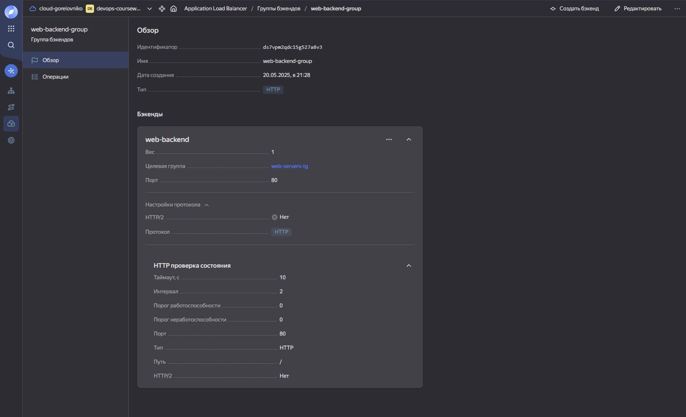

#  Курсовая работа на профессии "DevOps-инженер с нуля" - `Горелов Николай`


Содержание
==========
* [Задача](#Задача)
* [Инфраструктура](#Инфраструктура)
    * [Сайт](#Сайт)
    * [Мониторинг](#Мониторинг)
    * [Логи](#Логи)
    * [Сеть](#Сеть)
    * [Резервное копирование](#Резервное-копирование)


---

## Стандартные приготовления для работы с Yandex Cloud:
* Зарегистрироваться в Yandex Cloud
* Создайте платежный аккаунт (привязав банковскую карту)
* Активация промокода от Netology
* Создать сервисный аккаунт для работы с Yandex Cloud через terraform. Роль editor достаточно для всех манипуляций

На этапе создания сервисного аккаунта первый и последний раз будет доступен authorized_key.json. Его надо сохранить к себе на ПК. В моём случае это папка с курсовой работой.

Все файлы содержащие чувствительные данные будут добавлены в файл ".gitignore" для недоступности к добавлению на github.

Все дальнейшие действия будут через terraform и ansible.

ansible/inventory.ini создаётся автоматически с поомщью ansible.


---

## Задача

По условиям задачи нам понадобиться как минимум 7 виртуальных машин:  


---

## Инфраструктура
Для развёртки инфраструктуры используем Terraform и Ansible. 

Заходим в папку с файлами terraform и вводим команду:

``` bash

terraform init

```
После инициализации подсключения:


``` bash

terraform apply
...
yes
...

```
Результат:

  


Так как запуск ansible будет происходить с локальной машины, то с целью безопасности сохраним закрытый ключ в фоновом процессе с помощью следующих команд:

  

Это позволит выполнять авторизацию на всех созданных машинах в облаке через bastion виртуальную машину. 

Запускаем разворачивание всех необходимых компонентов с помощью:

``` bash

nimda@vm1:~/Netology/netology-coursework$ ansible-playbook ansible/site.yml -i ansible/inventory.ini

```

Результатом будет следующее:

  
   


---

### Сайт

Роли ansible 'webserver' и 'filebeat' установит на созданные сервера все необходимые компоненты. А именно nginx, файлы сайта, nginx-reporter и node-exporter.

Я использовал сайт из одного из домашних заданий.

До этого по условиям задания были автоматически созданы следующие компоненты:

* [Target Group](https://cloud.yandex.com/docs/application-load-balancer/concepts/target-group):  


* [Backend Group](https://cloud.yandex.com/docs/application-load-balancer/concepts/backend-group):



* [HTTP router](https://cloud.yandex.com/docs/application-load-balancer/concepts/http-router):  


* [Application load balancer](https://cloud.yandex.com/en/docs/application-load-balancer/):  


Тестируем сайт с помощью команды и получаем результат:

``` bash

curl -v <публичный IP балансера>:80`

```


---

### Мониторинг

Ansible как и в предыдущем случаем автоматически установить необходимые компоненты для мониторинга и настроит их. Результатов будет следующее:  

  
  
  
  


---

### Логи
Cоздайте ВМ, разверните на ней Elasticsearch. Установите filebeat в ВМ к веб-серверам, настройте на отправку access.log, error.log nginx в Elasticsearch.

На созданные ВМ с помощью ansible разворачиваются Kibana, Elasticsearch и автоматически конфигурируются на приём данных от filebeat на веб-серверах. Результат:  

  


---

### Сеть

Terraform настраивает [Security Groups](https://cloud.yandex.com/docs/vpc/concepts/security-groups) соответствующих сервисов на входящий трафик только к нужным портам.

Все ВМ добавлены в группу с ssh доступом по private_ip.

Получаем список сетей и security groups:  

  
  
  


---

### Резервное копирование
Создание snapshot дисков всех ВМ также происходит через terraform. По условиям ограничиваем время жизни snaphot на неделю. Сами snaphot настроены на ежедневное копирование. Результат:

  

---